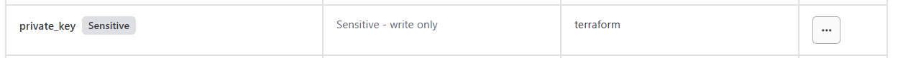
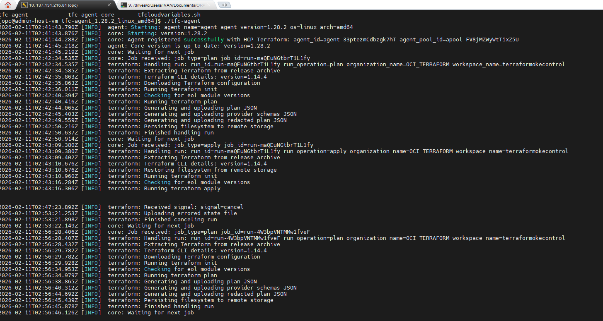
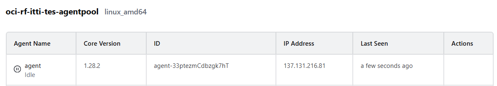
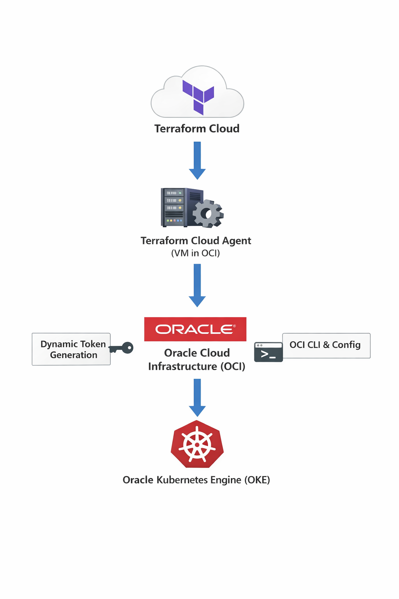
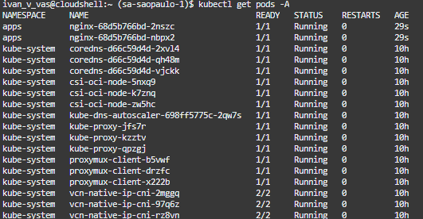

# Terraform Cloud Integration with Oracle Cloud Infrastructure (OCI) and Oracle Kubernetes Engine (OKE)

## Introduction

This documentation demonstrates how to integrate **Terraform Cloud** with **Oracle Cloud Infrastructure (OCI)** to manage Kubernetes resources inside an existing **Oracle Kubernetes Engine (OKE)** cluster.

The goal of this project is to provision Kubernetes objects (a namespace and an Nginx deployment) from Terraform Cloud using secure, dynamic authentication without relying on a static kubeconfig file.

---

## Documentation / Background

Terraform Cloud supports two execution models:

- Hosted Runners (managed by HashiCorp)
- Terraform Cloud Agents (self-hosted)

When working with OCI and OKE, Kubernetes authentication requires generating a temporary token using the OCI CLI. Because hosted runners do not include OCI CLI, this project adopts a Terraform Cloud Agent running inside OCI.

---

## Main Points

### Terraform Connection to OCI

Terraform OCI provider supports two ways to supply private keys:

- `private_key` → Expects the PEM content of the private key as a string  
- `private_key_path` → Expects the file path to the private key  

For this project:

- `private_key` is used
- The private key is stored as a **sensitive variable** in Terraform Cloud

  


Benefits:

- No private key files stored on disk
- Credentials remain encrypted
- Easier automation

---

### Dynamic Retrieval of OKE Cluster Certificate

Terraform retrieves OKE cluster information using:

```
data "oci_containerengine_cluster_kube_config" "oke" {
  cluster_id = var.cluster_id
}

locals {
    kubeconfig_yaml = data.oci_containerengine_cluster_kube_config.this.content
    kubeconfig = yamldecode(local.kubeconfig_yaml)
    
    cluster_entry = local.kubeconfig.cluster[0].cluster
    
    host = local.cluster_entry.server
    cluster_ca_certificate = base64decode(local.cluster_entry["certificate-authority-data"])
}

```

Terraform dynamically extracts:

- Kubernetes API Server endpoint

- Certificate Authority data (base64 decoded)

Benefits:

- No static kubeconfig file required

- No manual certificate management

- Fully Infrastructure-as-Code

### Issues Identified

**Terraform Cloud Hosted Runners Cannot Authenticate to OKE**

OKE authentication requires executing:

```
oci ce cluster generate-token

```
Limitations:

- Terraform Cloud hosted runners do not include OCI CLI

- Token cannot be generated

- Kubernetes provider authentication fails

Result:

Terraform Cloud cannot connect directly to OKE when using hosted runners.

### Solution

**Terraform Cloud Agent Deployed Inside OCI**

A Terraform Cloud Agent was installed on a Virtual Machine inside OCI with:

- OCI CLI installed

- ~/.oci/config properly configured

- Private key with correct permissions

- Network access to OKE cluster

**Authentication Flow**

- Terraform Cloud sends execution to the Agent

- Agent runs Terraform inside OCI

- Agent executes oci ce cluster generate-token

- Temporary token is generated

- Terraform authenticates successfully to OKE

  

  
  

Benefits:

Dynamic token-based authentication

No persistent kubeconfig

Secure execution


### Architecture



### Demo Result
- Namespace apps created successfully

- Nginx deployment created successfully

- Resources provisioned from Terraform Cloud

- Code stored in GitHub

- Authentication fully dynamic




---

## Author

**Ivan Vasquez**  
LAD A-Team Cloud Solution Specialist  
Oracle Cloud Infrastructure (OCI)


